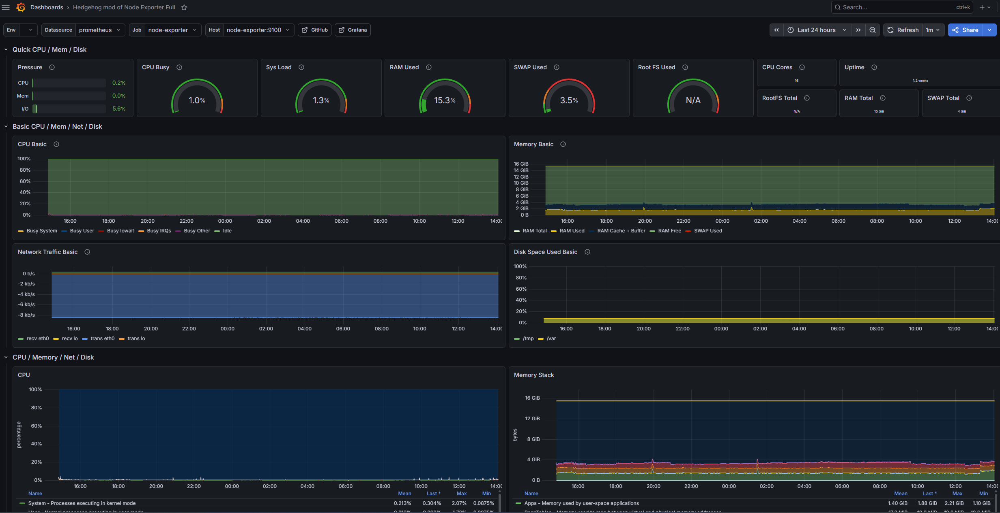
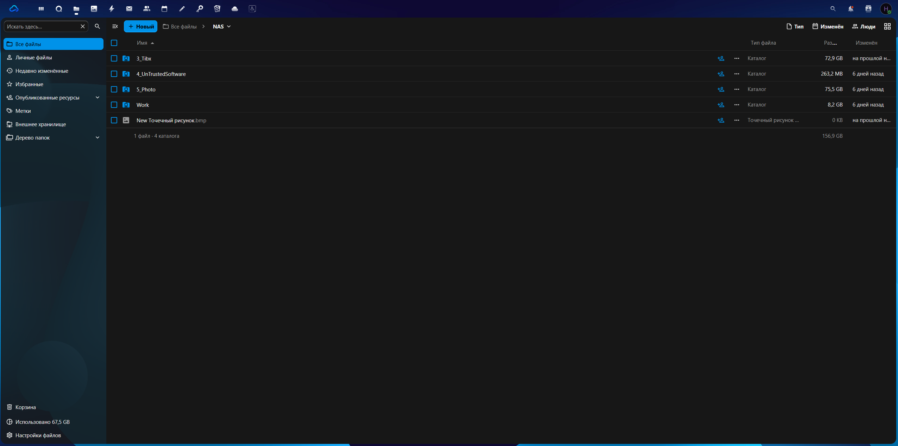
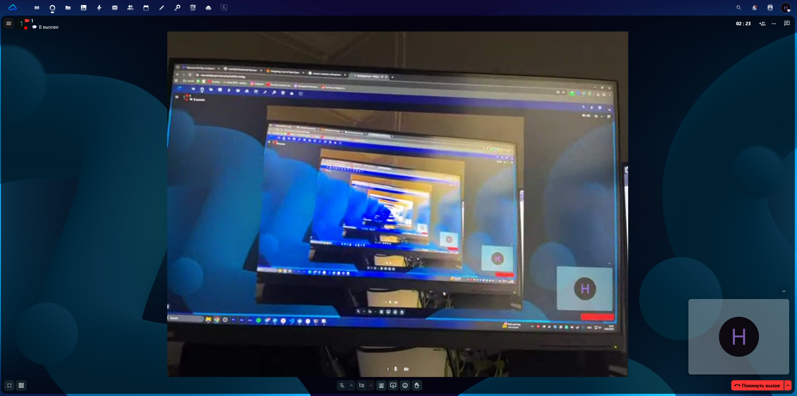

# 🏠 Домашний Дата-Центр

**Личное облако, мессенджер и система мониторинга в контейнерах Docker.**

[](https://skillicons.dev)

## 🎯 О проекте

Полностью автономная инфраструктура (почти*) для личного облака, развернутая на **Windows 11** с использованием **Docker и Docker Compose**.  
Проект создан для демонстрации навыков контейнеризации, настройки обратного прокси, мониторинга, интеграции с внешними API и автоматизации с помощью Python.

P.S Проект выполнен самостоятельно, с использованием AI-ассистента для ускорения написания конфигураций и скриптов, а так же для изучения основ по принципу реверс-инжиниринга

## 🧱 Архитектура и взаимодействие сервисов

Все сервисы объединены в единую сеть Docker и управляются через `docker-compose.yml`:

- **Nextcloud** - центральное облачное хранилище, доступное по HTTPS через собственный домен.
- **Nextcloud Talk** - корпоративный мессенджер с аудио/видеозвонками (настроен High Performance Backend).
- **Nginx Proxy Manager** - обратный прокси-сервер с автоматическим выпуском SSL-сертификатов.
- **MariaDB** - база данных для Nextcloud.
- **Prometheus + Grafana + cAdvisor + Node Exporter** - система сбора и визуализации метрик.
- **Python-скрипты** - автоматическая проверка состояния Nextcloud с отправкой отчета в Telegram.

## 🛠 Технологический стек

| Категория       | Инструменты                                          |
|-----------------|------------------------------------------------------|
| 🐳 Контейнеры    | Docker, Docker Compose, Docker Volumes               |
| 🌐 Веб-сервер    | Nginx (прокси и реверс-прокси), Let's Encrypt                                                |
| 📊 Мониторинг    | Prometheus, Grafana, cAdvisor, Node Exporter                                                 |
| 💾 Базы данных   | MariaDB, SQLite                                                                              |
| 🐍 Скрипты       | Python (requests, python-telegram-bot, subprocess)                                           |
| 🔗 Интеграции    | Nextcloud API, Telegram Bot API, Gmail (IMAP/SMTP)                                           |
| ⚙️ Deployment    | Развертывание и управление жизненным циклом контейнеров на основе Docker Compose             |
| 🧰 Прочее        | Git, GitHub, PowerShell, WSL2                                                                |

## 🤖 Автоматизация и Telegram-бот

Бот выполняет две ключевые функции:
- Предоставляет сводку о состоянии Nextcloud и Docker-контейнеров по запросу.
- Автоматически оповещает о падениях контейнеров каждые 5 минут.

### Доступные команды
| Команда | Описание |
|---|---|
| `/start` | Подписаться на автоматические уведомления о падениях. |
| `/status` | Получить сводку о текущем состоянии Nextcloud. |
| `/run_status` | Принудительно запустить проверку Nextcloud и получить отчёт. |
| `/containers` | Получить список всех Docker-контейнеров с их статусом. |

### Принцип работы
1. По команде `/status` или `/run_status` бот запускает `nextcloud_status.py`, который обращается к API Nextcloud и возвращает версию, статус и режим обслуживания.
2. Команда `/containers` запускает `container_monitor.py`, собирает состояние всех контейнеров через Docker SDK и формирует JSON-отчёт.
3. Каждые 5 минут бот автоматически сравнивает текущее состояние контейнеров с предыдущим снимком. Если зафиксировано падение (статус изменился с `running` на `exited`), подписчику отправляется тревожное сообщение с именем контейнера и кодом завершения.

## 🔒 Безопасность

- Внешнее хранилище `/mnt/nas` смонтировано с правами **`770`** и владельцем **`www-data`** (UID 33). Доступ к данным имеет только процесс Nextcloud.
- Доступ к Nextcloud и сопутствующим сервисам осуществляется **только по HTTPS** через Nginx Proxy Manager с автоматическим выпуском SSL-сертификатов.
- Все пароли, токены и секретные ключи вынесены в файл `.env`. В `docker-compose.yml` используются ссылки на переменные окружения (`${MYSQL_PASSWORD}` и т.д.).
- Для Python-скриптов конфиденциальные данные загружаются из переменных окружения с помощью библиотеки `python-dotenv`.
## 📸 Как это выглядит

  
*Базовый дашбоард*

  
*Веб-интерфейс Nextcloud с подключенным внешним диском (NAS) и почтовым клиентом.*

  
*Видеозвонок через Nextcloud Talk с использованием High Performance Backend.*

## 🚀 Быстрый старт

### 📋 Требования
- Windows 10/11 с WSL2 и Docker Desktop
- Статический IP-адрес и домен (например, `nextcloud.xyz`)
- На роутере проброшены порты **80, 443, 3478 (TCP/UDP)** на ваш ПК
- Свободное дисковое пространство: ~20 ГБ

### 🔐 Настройка секретов
Все чувствительные данные вынесены в файлы `.env`, которые **не хранятся в репозитории**. Перед первым запуском создайте их вручную.

1. **Основной стек** (в корне проекта, рядом с `docker-compose.yml`):  
   Создайте файл `.env`:
   ```ini
   MYSQL_ROOT_PASSWORD=ваш_надёжный_пароль_root
   MYSQL_PASSWORD=ваш_пароль_пользователя_nextcloud

2. **Мониторинг** (в папке `monitoring/`):
    Создайте файл `.env`:
    ```ini
    GRAFANA_PASSWORD=ваш_пароль_администратора_grafana
3. Создайте HPB для Talk (в папке `talk-hpb/`, опционально):
   Создайте файл `.env`:
    ```ini
    TURN_SECRET=ваш_turn_secret
    SIGNALING_SECRET=ваш_signaling_secret
    INTERNAL_SECRET=ваш_internal_secret
4. Telegram-бот (в папке `scripts/` и `bots/`):
   Создайте файл `.env`:
   ```ini
   BOT_TOKEN=токен_вашего_бота_от_BotFather

## 🐳 Запуск сервисов
## Основные сервисы (Nextcloud, MariaDB, Nginx Proxy Manager):
    cd F:\NextcloudData   # или путь, куда вы склонировали репозиторий
    docker compose up -d
## Стек мониторинга (Prometheus, Grafana, cAdvisor, Node Exporter):
    cd monitoring
    docker compose up -d
    cd ..
## HPB для Nextcloud Talk (для групповых звонков):
    cd talk-hpb
    docker compose up -d
    cd ..
## Telegram-бот (автоматизация и уведомления):
    cd scripts
    pip install -r requirements.txt
    python nextcloud_bot.py
После запуска отправьте боту команду /start, чтобы подписаться на уведомления о падениях контейнеров.

## ✅ Проверка работоспособности

| Сервис | Адрес | Учётные данные |
|---|---|---|
| Nextcloud | `https://ваш-домен` (например, `nas.nehade.xyz`) | Те, что были заданы при установке |
| Nginx Proxy Manager | `http://локальный-IP:81` | По умолчанию `admin@example.com` / пароль из `.env` |
| Grafana | `https://monitor.ваш-домен` | Логин `admin`, пароль из `.env` |
| Prometheus | `http://localhost:9090` | Без аутентификации |
| Telegram-бот | Команда `/status` в чате с ботом | – |

## 📈 Ключевые результаты

- ✅ **Автоматическое восстановление** всех контейнеров после сбоев (`restart: always`).
- ✅ **Мониторинг 10+ ключевых метрик** хоста и контейнеров в реальном времени (CPU, RAM, сеть, диск, топ-процессы).
- ✅ **Автоматическая проверка состояния Nextcloud** через Telegram-бота с ручным запуском и по расписанию (планировщик Windows).
- ✅ **Автоматические уведомления о падениях контейнеров**: бот каждые 5 минут сравнивает состояние контейнеров с предыдущим снимком и присылает тревогу при обнаружении падения.
- ✅ **Настроен HPB для Talk**, что позволяет проводить видеозвонки с 5+ участниками без задержек.
- ✅ **Интеграция с Gmail (IMAP/SMTP)** для почты, контактов и календарей.
- ✅ **Управление паролями** через встроенный менеджер Passwords с импортом CSV.
- ✅ **Безопасность**:
  - права на внешнее хранилище `770` с владельцем `www-data`;
  - все секреты вынесены в `.env` (в `.gitignore`);
  - образы зафиксированы на конкретных версиях (без `latest`);
  - все соединения извне по HTTPS с Let's Encrypt.
- ✅ **Полная документация**(наверное): README с архитектурой, стеком, структурой и быстрым стартом; техническая документация в `DOCS.md`; скриншоты интерфейсов.

## 📁 Связанные репозитории

- **[ansible-playbooks](https://github.com/neoHaDe/ansible-playbooks)** — плейбуки для настройки серверов (в процессе).

## 📫 Контакты

- ✉️ [Email](mailto:nehadebackup@gmail.com)
- 📬 [Telegram](https://t.me/neHade)  
